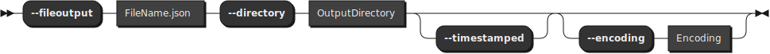
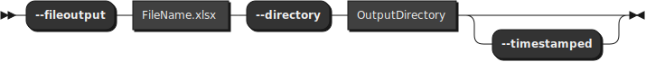
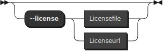

# FastBCP

FastBCP is a command line that export data from a database to CSV , JSON,  Parquet or XLSX file(s) (or even binary file(s))


## Table of Contents

- [Supported Sources & Platforms](#supported-sources--platforms)
- [Supported OS](#supported-os)
- [Quick Start : installation and wizard](#quick-start--installation-and-wizard)
- [Usage](#usage-)
- [Parameters details](#parameters-details)
- [Logging](#logging)
- [Some performance results](#some-performance-results)
- [Examples](#examples)


## Supported Sources & Platforms

Source | Windows AMD64 | Linux AMD64 | Linux ARM64
:--- | :---: | :---: | :---:
ClickHouse | ✅ | ✅ | ✅
DuckDB | ✅ | ✅ | ✅
MySQL | ✅ | ✅ | ✅
Netezza | ✅ | ✅ | ❌
ODBC | ✅ | ✅  | ✅
OLEDB | ✅ |❌  | ❌
Oracle | ✅ | ✅ | ✅
PostgreSQL | ✅ | ✅ | ✅
SQL Server | ✅ | ✅ | ✅
SAP Hana | ✅ | ✅ | ❌
Teradata | ✅ | ✅ | ❌

## Supported OS

### Linux

| OS                            | Versions                    | Architectures         | 
| ----------------------------- | --------------------------- | --------------------- | 
| Amazon Linux                  | 2023 (Kernel 6.1)		      | Arm64, x64            | 
| Alpine                        | 3.21, 3.20, 3.19, 3.18      | Arm64, x64            | 
| Azure Linux                   | 3.0                         | Arm64, x64            | 
| CentOS Stream                 | 10, 9                       | Arm64, x64            | 
| Debian                        | 12                          | Arm64, x64            | 
| Fedora                        | 41, 40                      | Arm64, x64            | 
| openSUSE Leap                 | 15.6                        | Arm64, x64            | 
| Red Hat Enterprise Linux      | 10, 9, 8                    | Arm64, x64            | 
| SUSE Enterprise Linux         | 15.6                        | Arm64, x64            | 
| Ubuntu                        | 24.10, 24.04, 22.04, 20.04  | Arm64, x64            | 


Here is a page that documents how to check the certificate on Linux. : [check linux certificate](./security/check_certificate_linux.md).

### Windows

| OS                            | Versions                    | Architectures         | 
| ----------------------------- | --------------------------- | --------------------- | 
| Nano Server                   | 2025, 2022, 2019            | x64                   |
| Windows                       | 11 24H2 (IoT), 11 24H2 (E), 11 24H2, 11 23H2, 11 22H2 (E), 10 22H2, 10 21H2 (E), 10 21H2 (IoT), 10 1809 (E), 10 1607 (E) | x64 |
| Windows Server                | 2025, 23H2, 2022, 2019, 2016, 2012-R2, 2012 | x64 |  |
| Windows Server Core           | 2025, 2022, 2019, 2016, 2012-R2, 2012 | x64     |


## Quick Start : installation and wizard
If you want to use it quickly, download the lastest Release and unzip it to a directory. For Linux user run a `chmod +x FastBCP` command.

For the trial you are read to run FastBCP.

**For other edition than trial you will need a valid license.** By default FastBCP will try to find a FastBCP.lic file in the same directory.  You can also provide another path or an url in your organisation using the `--license` parameter.

For the following databases drivers are embedded : Clickhouse, DuckDB, MS SQLServer, Netezza, Oracle, MySQL, PostgreSQL, SAP HANA and Teradata .

If you need another database not in the list, you can use ODBC or OLEDB but you will need to install your ODBC or OLEDB drivers of your favorite database in order to use it with ODBC or OLEDB connectiontype.

You can use the FastBCP Wizard to generate a FastBCP command line : [FastBCP Wizard](./FastBCP_Wizard.html)


# Usage :

# Syntax of FastBCP


## FastBCPCommand : 


## FastBCPOptions :


### ConnectionType:


### ConnectionParameters:


### SourceInfos:


### OutputInfoCSV:


### FormatCSVOptions:


**OutputInfoJSON:**




**FormatJSONOptions:**


**OutputInfoParquet:**


**OutputInfoXLSX:**




**FormatXLSXOptions:**


### OutputInfoBinary:


### CloudOptions:


### AdvancedParameters:


### Log Parameters:


### License Parameters :



# Parameters details

## Authentification

## Authentification Methods
There are several authentication methods allowed :
- Trusted Connection (`-A` switch or `--trusted`) if allowed by the rdbms
- SQL Login/Password (`-U` "UserName" `-X` "Password" or `--user` "UserName" `--password` "PassWord")

For Login/Password you can also use the environment variables like FASTBCP_USER and FASTBCP_PASSWORD for exemple or store the password in an encrypted file. 
Up to you to decrypt the file and it's content before using it in a shell variable that will be used with FastBCP.
You can also use the `--connectionstring` parameter to define a connection string that will be used to connect to the database. This connection string can contain the user and password in it or use an alternative method of authentication.


## Connection Parameters

### DSN (`-N` or `--dsn`)
if you have choosen an odbc connection type you must define the DSN with the -N or --dsn parameter or define a connection string (-G or --connectionstring) 

### Provider (`-P` or `--provider`)
if you have choosen an oledb connection type you must define the OLEDB provider with the -P or --provider parameter (-P MSOLEDBSQL or -P NZOLEDB for example)

### Server (`-S` or `--server`)
except if you have define a connection string (-G or --connectionstring), you must define a server (or could also be a TNS entry for oracle).
server could be :
- an IP address or a DNS name.
- an IP address or a DNS name and a port number : "myserver.mydomain.com:2433"
- an IP address or a DNS name and a named instance  : "myserver.mydomain.com\myinstance"
- for duckdb you can use a file path : "C:\temp\myduckdb.db" or ":memory:" for an in memory database
- for oracle you can use a easy connect string : "myserver.mydomain.com:1521/myinstance"

### Database (`-I` or `--database`)
Optionnaly define a source database.

### Connection String (`-G` or `--connectionstring`)
You can use a connection string to define the connection to the database. This connection string will override any other connexion parameters. 
You can use the connection string for any connection type. The connection string must be enclosed in double quotes.

## Source Infos

### Query (`-q` or `--query`)
The query (-q) allow you to specify your extraction as a select statement

### Input File (`-F` or `--fileinput`)
the input file that must contains only one query.
The query must **not** have a trailing semicolon (;)

### Source Schema (`-s` or `--sourceschema`)
If no query nor input file is used the source schema and source table can also be used to extract the sourceschema.sourcetable.
This field is mandatory if some parallel method is used like Rowid and Ctid

### Source Table (`-T` or `--sourcetable`)
If no query nor input file is used the source schema and source table can also be used to extract the sourceschema.sourcetable.
This field is mandatory if some parallel method is used like Rowid and Ctid


## OutputInfo

### Directory (`-D` or `--directory`)
Specify where the output file will be generated. it could be a local directory or and s3 location (s3://bucket/dir/subdir)

### Output file (`-o` or `--fileoutput`)
The name of the final file generated by FastBCP.
**IMPORTANT : the file extension will define the output format : csv, tsv, json, parquet, xlsx or binary (postgresql source only for binary)**
 For parallel extraction without merge, the file name (without file extension) will be used as a prefix for the distributed files. 

### Timestamped output (`-x` or `--timestamped` switch)
Will add a timestamp to the output file name if the switch is used

### Encoding (`-e` or `--encoding`)
The characterset encoding of the output file. Default is `UTF-8`


## CSV Data Formatting

### Delimiter (`-d` or `--delimiter`)
The character(s) that will be used as field delimiter

### Use Quotes Identifier (`-t` or `--quotes`)
Add quotes "" for string fields (will escape " by \ if found in the data field)
value can be `true` or `false`

### Date Format (`-f` or `--dateforma`)
Date format like "yyyy-MM-dd HH:mm:ss"

### Decimal Separator (`-n` or `--decimalseparator`)
Use for specify the decimal separator (can be `,` or `.`)

### No Header (`-h` or `--noheader` switch)
If you don't want to have a header in the output file, use the -h or --noheader switch

### Boolean Format (`-b` or `--boolformat`)
How boolean are formatted (`true/false`, `t/f` or `1/0`)

## Cloud Options
### cloud profile (--cloudprofile)
specify the name of the profile (defined using aws cli : `aws configure --profile profilename`)

**Nota** : You must set the environment variable FASTBCP_CLOUD_PROVIDER to aws
- on linux : `export FASTBCP_CLOUD_PROVIDER=aws`
- on windows powershell : `$env:FASTBCP_CLOUD_PROVIDER="aws"`

## Advanced Parameters 

### Distribution Method (`-m` or `--method`)
You can improve performance by using a method for parallelize the export (`-m` or `--method`) and a degree of parallelism (-p or --paralleldegree).
The method (`-m` or `--method`) can take several values :
- `None` (No parallelism)
- `Random` : this method is linked to a distribution column that must be an integer/bigint and that should have many values  (at least as many as the dop)
- `DataDriven` : this method will use all the values of a column to split the export to different files. If the number of values is greater than the dop, the dop will be used like a throttling. You can use an expression in the distributekeycolumn parameter instead a column ==> eg : YEAR(o_orderdate).
- `Rowid` : this method use internal hidden field to retrieve chunk of data. Each parallel thread will export a portion of the data based on the ROWID range. Oracle like databases only.
- `Ctid` : this method use internal hidden field to retrieve chunk of data. Each parallel thread will export a portion of the data based on the CTID range. PostgreSQL like databases only.
- `RangeId` : this method use the distributed column field and it's min and max value to retrieve chunk of data. Each parallel thread will export a portion of the data based on a range build using de distributed column values. Best if table is clustered by this field. The unicity of the distributed column is **not** mandatory.
- `Ntile` : this method use the distributed column field and ntile values to retrieve evenlly distributed chunk of data. Each parallel thread will export a portion of the data based on a range build using the distributed column values. The unicity of the distributed column is **not** mandatory.
 
Table of Distribution Method :

| method     | need a distributed column | database source type |
|:-------    | :------------------------:| :-------------------:|
| None       | No						 | Any					|
| Random     | Yes						 | Any					|
| DataDriven | Yes						 | Any					|
| Ctid		 | No						 | PostgreSQL (pgsql/pgcopy) |
| Rowid		 | No						 | Oracle (oraodp)      |
| RangeId	 | Yes						 | Any					|
| Ntile		 | Yes						 | Any					|


### Distribute Key Column (`-c` or `--distributekeycolumn`)
Define the column (or computation) on the data source that will be used to split the data into several parts. FastBCP will use SQL queries that will run in parallel against the source. Each query will have a where clause that will retrieve a part of the total data.

### Degree of Parallelism (`-p` or `--paralleldegree`)
the degree of parallelism could be 0. In this case the dop we be allign with the number of cores(threads if HT is on) on the machine where you run FastBCP.
If the dop is greater than the number of cores (or threads if HT is on) then it will be downscale to the number of cores/threads of the machine.
If the dop is less than 0 it will be computed as the number of cores/(abs(dop)). For exemple if you have 16 cores and you set dop to -2 then the dop will computed and set to 8.

### Merge (`-M` or `--merge`)
You can specify if the "temporary" files generated for the parallel export should be merge to the final ouput file and deleted or if you prefer to keep the distributed files without merging them (faster export and later faster import).
**Warning** : Current version allow valid merge for CSV and Parquet only.

### License (`--license`)
By defaulf FastBCP will try to use the license file named FastBCP.lic in the same directory as FastBCP. You can specify a custom license file using the `--license` parameter to define another filepath or even an http endpoint to retrieve the license file.

# Logging 
## Parameter Logs targets using FastBCP_settings.json
FastBCP can log informations in 3 modes :
- Console
- File
- Database (MSSQL and PostgreSQL Only)

You can use several targets at the same time.

You can adapt what and where you want to log using the `FastBCP_settings.json` file.
If this file is not present in the same directory that FastBCP, FastBCP will use the console log only.
You can also use a custom file name for the settings file using the `-f` or `--settingsfile` parameter.

Some settings files samples can be found here :
 - [FastBCP_Settings.json for Windows with Console + Files + MSSQL sinks](logging/FastBCP_Settings.json)
 - [FastBCP_Settings_Linux_Console_Files.json for Linux with Console + Files](logging/FastBCP_Settings_Linux_Console_Files.json)
 
### Log Levels
to configure the log level you can change the MinimumLevel in the ***FastBCP_settings.json*** file.
The log levels are :
- Debug
- Information
- Warning
- Error
- Critical

### Log Database
By default FastBCP will use the `FastBCP_settings.json` file to find where the log database is.
It looks for a mssql instance on localhost, and try to connect using SSPI trusted connection.

You can change the connection string in the ***FastBCP_settings.json*** file.
- The default MS_FastTransferLogs : "MS_FastTransferLogs": "Server=localhost;Database=FastTransferLogs;Integrated Security=SSPI;Encrypt=True;TrustServerCertificate=True"
- Exemple MS_FastTransferLogs : "MS_FastTransferLogs": "Server=mssqlloginstance,2433,;Database=FastTransferLogs;Integrated Security=SSPI;Encrypt=True;TrustServerCertificate=True"

Use a correct connection string for your log database.

In case the database is not reachable, FastBCP will failed and will refuse to continue. 
If you want to continue without logging in the database, you can rename the ***FastBCP_settings.json*** and FastBCP will use the console log only.

### Log Targets
You can configure the log targets in the ***FastBCP_settings.json*** file. in the **"WriteTo"** section.
You can remove or adapt the targets as you want but be carrefull : any error in the FastBCP_settings.json file will prevent FastBCP to start.
You can try with and without the FastBCP_settings.json file to see the difference.


## Some performance results


You can have a lookp on the live [FastBCP Performance dashboard](https://public.tableau.com/views/FastBCPPerformanceDashboard/FastBCPPerformance?:language=en-US&publish=yes&:display_count=n&:origin=viz_share_link) here 

# Examples

### Parallel Extraction using several methods (on windows using powershell and long names parameters) :

#### Parallel using Random from mssql to csv :
``` powershell
.\FastBCP.exe `
--connectiontype mssql `
--server localhost `
--database "tpch10_collation_bin2" `
--trusted `
--query "SELECT * FROM dbo.orders" `
--directory "D:\temp" `
--fileoutput "mssql_orders.csv" `
--decimalseparator "." `
--delimiter "|" `
--dateformat "yyyy-MM-dd HH:mm:ss" `
--encoding "UTF-8" `
--method Random `
--distributekeycolumn "o_orderkey" `
--paralleldegree 7 `
--merge true `
--runid "mssql_to_csv_parallel_random"
```

#### Parallel using DataDriven from postgresql to parquet

``` powershell
.\FastBCP.exe `
--connectiontype pgsql `
--server "localhost:15432" `
--database "tpch10" `
--user "FastUser" `
--password "FastPassword" `
--query "SELECT * FROM dbo.orders" `
--directory "D:\temp" `
--fileoutput "mssql_orders.parquet" `
--method DataDriven `
--distributekeycolumn "YEAR(o_orderdate)" `
--paralleldegree 7 `
--merge false `
--runid "pgsql_to_parquet_parallel_datadriven"
```


#### Parallel using RangeId from postgresql to parquet

``` powershell
.\FastBCP.exe `
--connectiontype "pgcopy" `
--server "localhost:15432" `
--database "tpch" `
--user "FastUser" `
--password "FastPassword" `
--query "select * from tpch_10.orders WHERE o_orderdate between '19950101' and '19951231'" `
--directory "D:\temp" `
--fileoutput "orders_1995.parquet" `
--encoding "UTF-8" `
--method RangeId `
--distributekeycolumn "o_orderkey" `
--paralleldegree 7 `
--merge true `
--runid "pgcopy_to_parquet_parallel_rangeid"
```


#### Parallel using RowId from Oracle to Excel files

``` powershell
.\FastBCP.exe `
--connectiontype "oraodp" `
--server "localhost:1521/OraService" `
--database "tpch" `
--user "FastUser" `
--password "FastPassword" `
--sourceschema "TPCH" `
--sourcetable "ORDERS" `
--directory "D:\temp" `
--fileoutput "orders.xlsx" `
--encoding "UTF-8" `
--method RowId `
--paralleldegree 7 `
--merge false `
--runid "oracle_to_excel_parallel_rowid"
```

#### Parallel using RangeId from mssql to parquet on AWS S3 bucket:
``` powershell
.\FastBCP.exe `
--connectiontype mssql `
--server localhost `
--database "tpch10_collation_bin2" `
--trusted `
--query "SELECT * FROM dbo.orders" `
--directory "s3://targetbucket/bronze/tpch" `
--cloudprofile "fastbcp_profile" `
--fileoutput "mssql_orders.parquet" `
--method RangeId `
--distributekeycolumn "o_orderkey" `
--paralleldegree 12 `
--merge false `
--runid "mssql_to_parquet_aws_s3"
```


You can find more exemples in the [samples.ps1](samples.ps1.md) file

