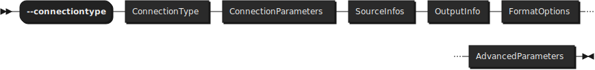
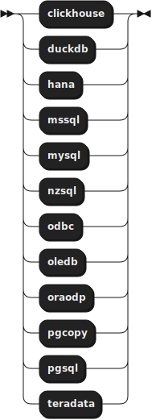
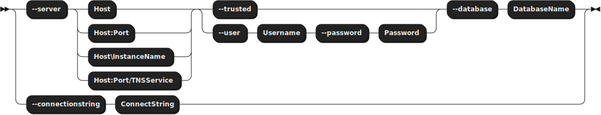
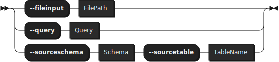
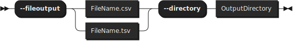
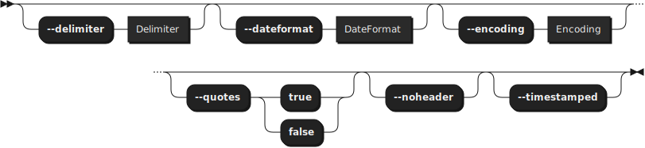
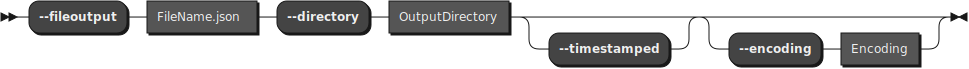
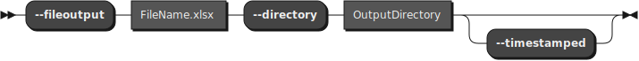
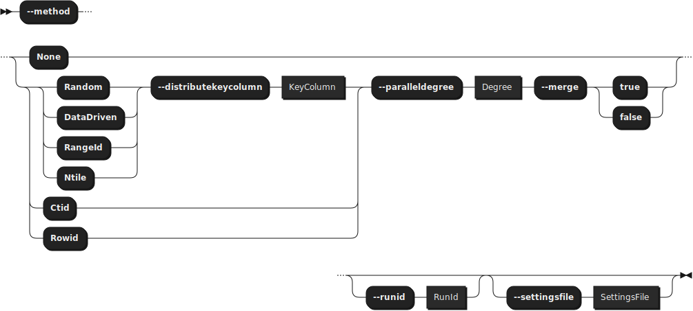

# Syntax of FastBCP

## FastBCPCommand : 

## FastBCPOptions :

### ConnectionType:

### ConnectionParameters:

### SourceInfos:

### OutputInfoCSV:

### FormatCSVOptions:

**OutputInfoJSON:**

**FormatJSONOptions:**

**OutputInfoParquet:**

**OutputInfoXLSX:**

**FormatXLSXOptions:**

### OutputInfoBinary:

### AdvancedParameters:

### LogParameters:

