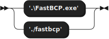

**Syntax:**

**FastBCPCommand:**

referenced by:

* Syntax

**FastBCPOptions:**

referenced by:

* Syntax

**ConnectionType:**

referenced by:

* FastBCPOptions

**ConnectionParameters:**

referenced by:

* FastBCPOptions

**SourceInfos:**

referenced by:

* FastBCPOptions

**OutputInfo:**

referenced by:

* FastBCPOptions

**FormatOptions:**

referenced by:

* FastBCPOptions

**AdvancedParameters:**

referenced by:

* FastBCPOptions

## 
 generated by [RR - Railroad Diagram Generator][RR]

[RR]: https://www.bottlecaps.de/rr/ui